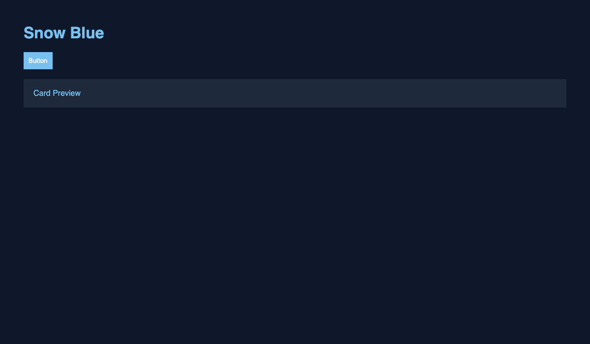

<p align="center">
  
</p>

# Snow Blue & Slate Amber Themes (BETA)

Low-glare VS Code theme pack for long coding sessions with **HTML, CSS, JS readability**.

Includes a **60–30–10 design system**, seasonal themes, and a live **Theme Studio (BETA)**.

---

## 🎥 Preview

<p align="center">
  
</p>

---

## 🎨 Themes

- 🌙 Slate Amber Night (Premium)
- ❄️ Snow Blue
- 🎄 Christmas Night
- ☀️ Christmas Day

---

## ⚡ Theme Studio (BETA)

Live editor inside VS Code:

- 🎛 Change colors instantly
- ⚡ Live preview updates
- 🧊 UI component preview

**Open:**

```bash
Ctrl+Shift+P > Snow Blue: Open Theme Studio
```

## 📦 Install

- Open VS Code → Extensions
- Search: **Snow Blue**
- Click Install

Marketplace:  
https://marketplace.visualstudio.com/items?itemName=haileryle.vscode-snow-blue

---

## 📄 License

Educational use only.
