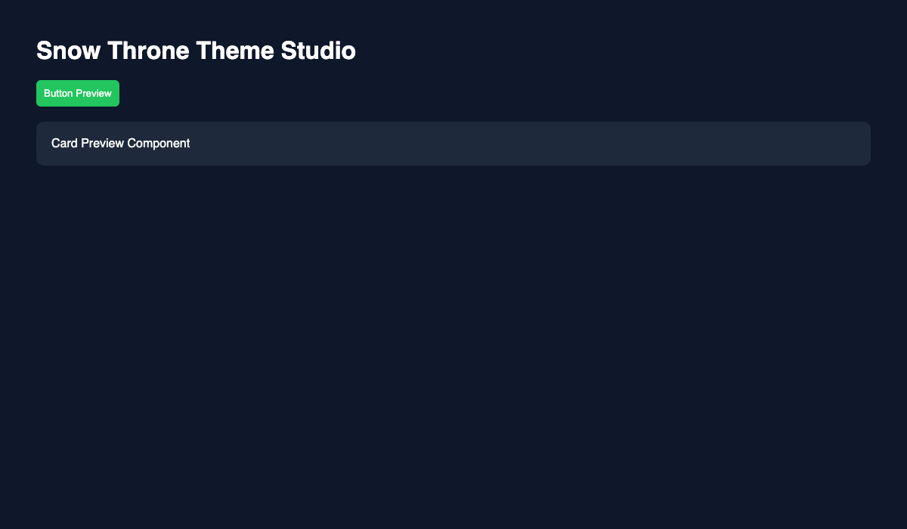

<p align="center">
  
</p>

# VS Code Snow Blue & Slate Amber Themes

**Snow Blue** is a calm, low-glare theme system designed for long coding sessions with a strong focus on **HTML, CSS, and JavaScript readability**.

It now includes a **premium Slate Amber Night theme** built using a 60–30–10 color system, along with festive Christmas themes for seasonal coding comfort. 🎄

It also includes a built-in **Snow Throne Theme Studio preview system** for live theme customization inside VS Code.

---

## 🎥 Live Preview

<p align="center">
  
</p>

---

## 🎨 Available Themes

### 🌙 Slate Amber Night (Premium Default)

A modern, high-contrast dark theme built using a **60–30–10 color system**:

- Deep slate background for reduced eye strain
- Blue-gray structure layers for UI clarity
- Warm amber accents for focus and highlights

---

### ❄️ Snow Blue (Default)

A calm snow-inspired dark theme focused on clean structure and readability.

- Soft dark background (not pure black)
- Clear syntax hierarchy for web development
- Reduced visual fatigue during long sessions

---

### 🎄 Christmas Night (Festive Dark Theme)

A cozy dark theme optimized for nighttime coding.

- Warm festive accents on a dark base
- Strong contrast without harsh glare
- Comfortable for long evening coding sessions

---

### ☀️ Christmas Day (Festive Light Theme)

A bright festive light theme designed for daytime use.

- High readability in bright environments
- Traditional Christmas palette
- Clean UI structure with warm accents

---

## ⚡ Snow Throne Theme Studio (Live Preview)

This extension includes a built-in **Theme Studio system**:

- 🎛 Live color editor (background, accent, text)
- ⚡ Instant preview updates inside VS Code
- 🧊 Button & card component preview system
- 🔄 Real-time theme switching sync
- 💾 Saves changes using VS Code `workbench.colorCustomizations`

### Open Theme Studio

`Ctrl+Shift+P` → **Snow Throne: Open Preview**

---

## 📦 Installation

### Install from VS Code Marketplace (Recommended)

1. Open **VS Code**
2. Go to **Extensions** (`Ctrl+Shift+X`)
3. Search: **Vscode Snow Blue**
4. Click **Install**

Marketplace:
https://marketplace.visualstudio.com/items?itemName=haileryle.vscode-snow-blue

---

## ⚡ Usage

### 🎨 Switch Theme

`Ctrl+Shift+P` → **Snow Throne: Switch Theme**

### 🎛 Open Theme Studio

`Ctrl+Shift+P` → **Snow Throne: Open Preview**

### 🎨 VS Code Theme Picker

`Ctrl+K Ctrl+T`

---

## 🧠 Design System

Built using a **60–30–10 color rule**:

- 60% Base: deep slate backgrounds
- 30% Structure: UI separation layers
- 10% Accent: amber, ice blue, festive highlights

This ensures:

- Low eye strain
- Clear hierarchy
- Consistent UI behavior

---

## ⚡ Features

- 🌙 Premium Slate Amber Night theme
- ❄️ Snow Blue clean dark theme
- 🎄 Christmas Night & Day themes
- 🎛 Live Theme Studio (color editor)
- ⚡ Real-time preview system
- 🧊 UI component preview system
- 🧠 Long-session readability optimized
- 💾 VS Code settings integration

---

## 🎨 Color Palettes

### Slate Amber Night

```css
--slate-900: #0f172a;
--slate-800: #1e293b;
--slate-700: #334155;
--amber: #f59e0b;
--text: #e2e8f0;
```

```css
--bright-snow: #f8f9fa;
--platinum: #e9ecef;
--gunmetal: #343a40;
--carbon-black: #212529;
--ice-blue: #78c0f0;
```

### 🎄 Christmas

```css
--cinnabar: #ea4630;
--firebrick: #bb2528;
--orange-yellow: #f8b229;
--dark-green: #146b3a;
--deep-green: #165b33;
--white: #ffffff;
```

---

## 📄 License

This project uses a custom Educational Use license.
Commercial use is not permitted without written permission.
See [LICENSE](./LICENSE) for full details.
